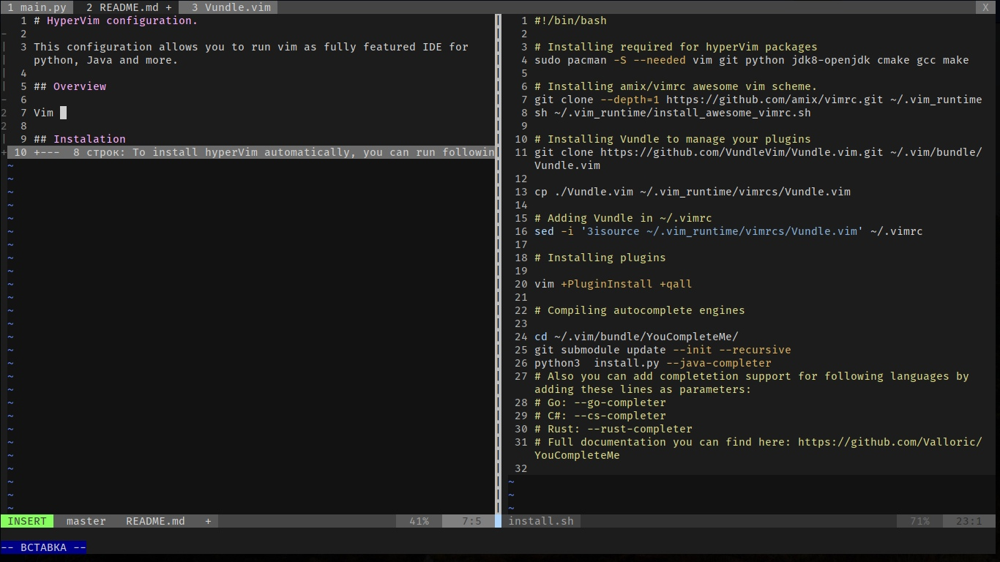
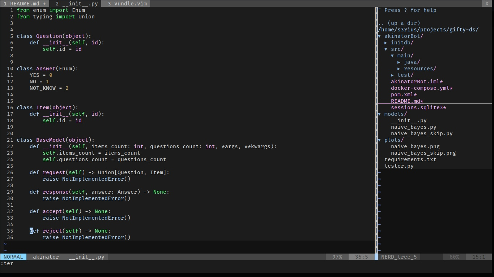
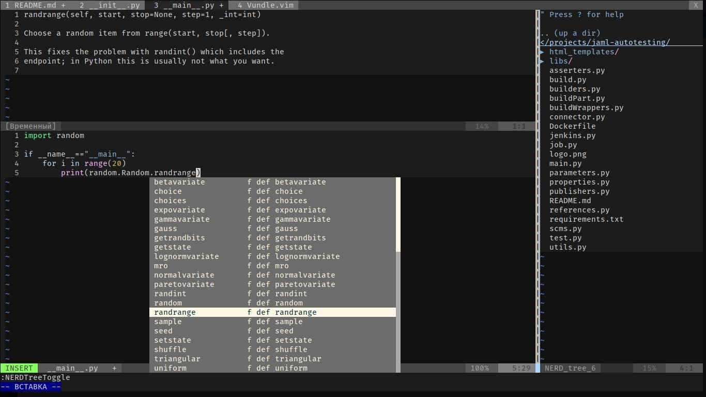

<h1 align="center">
  
</h1>

<h3 align="center">Make your vim hyper flexible</h3>


<p align="center">
  <a href="#overview">Overview</a> •
  <a href="#installation">Installation</a> •
  <a href="#completion-engine">Completion Engine</a> •
  <a href="#shortcuts">Shortcuts</a>
</p>

# Overview

This vim configuration allows you to build your own flexible IDE.







# Installation

To install hyperVim automatically, you can run following:
**Note: ** this script works only for arch-based linux distros. To install on other systems you need to edit install.sh by changing pacman with your system package manager and change packages name if needed. After that you can run script as usual.

```bash
chmod 777 install.sh
./install.sh
``` 

# Completion engine

In hyperVim we using "YouCompleteMe" code completion engine made by <a href="https://github.com/Valloric">Valloric</a>

YCM engine supported languages:
* Go
* Rust
* C-family (C, C++, Objective-C, Objective-C++, CUDA)
* Python
* Go
* С#
* TypeScript
* Java
* and an omnifunc-based (Ruby, PHP e.t.c.)

To add new language code completition you need to recompile code completition engine.

```bash
cd ~/.vim/bundle/YouCompleteMe/
python3 install.py --java-compiler --...
```

Additional parameters listed in install.sh.

Full documentation can be found in <a href="https://github.com/Valloric/YouCompleteMe">source repository</a>.

# Shortcuts

Editor shortcuts:

* `:tabe filename` - open file in new tab.
* `:spl filename` - open file in horizontal split view.
* `:vsp filename` - open file in vertical split view.
    
    Navigation in split view:
    * `Control + H` - navigate to the left split.
    * `Control + J` - navigate to the bottom split.
    * `Control + K` - navigate to the top split.
    * `Control + L` - navigate to the right split.
    * `Control + W + W` - navigate to the next split.

* `Control + M` - Open project tree-view.
* `Control + Shift + down_arrow_key` - next tab.
* `Control + Shift + up_arrow_key` - previous tab.
* `#gt` - switch to # tab.

projectTree shortcuts:

* `T` - open file in new tab
* `Shift + I` - show/hide hidden files.
* `Shift + T` - open file in new tab silently. 
* `Shift + C` - set chosen directory as root dir.
* `S` - open item in  split view.
* `R` - refresh tree.
* `M` - open menu.

While editing python file:

* `<leader> + G` - go to the definition. 
* `Control + Space` - show suggestions.

**Note:** <leader>-key can be set in ~/.vim_runtime/vimrcs/Vundle.
